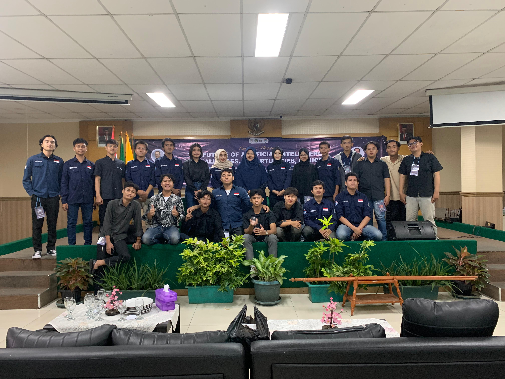

Pada tanggal 12 Juni 2024 HIMTIF Universitas Raharja melakukan kegiatan Seminar Nasional dengan tema "The Future of Artificial Inteligence Challenges, Opportunities, Ethics" Dilaksanakan secara Hybrid yang diisi oleh 2 narasumber yaitu **Bpk. Dr. Tri Basuki Kurniawan S.Kom, M.Eng, Ph.d** dan **Bpk Prof. Doc. Ir. Hamdani , ST, M.Cs, IPM**.
