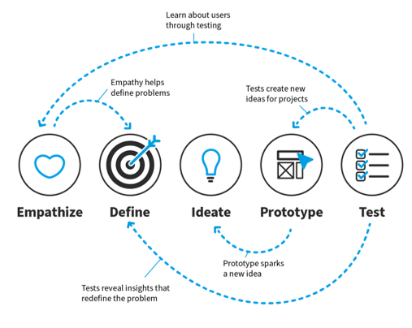

# Chapter 1 : Apa itu Design Thinking?

Menurut Interaction Design Foundation, Design Thinking adalah proses yang iteratif dan linear yang digunakan ketika kamu ingin memahami user, melakukan definisi ulang permasalahan yang ada, dan menciptakan solusi yang inovatif.

Design Thinking berfokus pada mengintegrasikan kebutuhan user, kapabilitas teknologi, dan bisnis.

Design Thinking melibatkan seluruh pihak dalam prosesnya, hal ini menjadi kelebihan Design Thinking dimana kita menyelesaikan masalah dengan melihatnya dari berbagai sisi.

Secara teknisnya, saya percaya Design Thinking dapat diterapkan dalam banyak bidang. Tidak hanya dalam membuat aplikasi tapi juga untuk keperluan engineering, arsitektur, advertising, organisasi, atau bahkan kehidupan sehari-hari.

Untuk UX Design, biasanya berfokus pada pengalaman dan bagaimana sebuah desain berjalan/berfungsi.

Pada gambar diatas, terlihat bahwa user memasukkan username ‘iamsupercool’ dimana sudah ada user yang menggunakan username itu, agar bisa memudahkan user dalam memahami kalau username itu tidak digunakan.

Maka ditambahkan fitur peringatan ‘this username already exists’ supaya user tahu bahwa username tersebut sudah digunakan.

Juga untuk memudahkan user dalam memilih username dari username yang sudah ada, kita dapat membuat fitur saran ‘Might want to try’ dimana dapat merekomendasikan username lain kepada user, supaya user dapat lebih cepat dalam memutuskan nama username.

