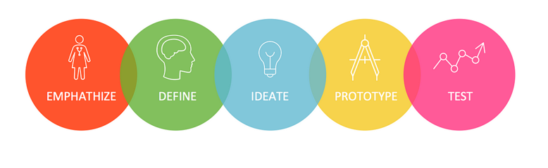

# Chapter 2 : Apa saja proses Design Thinking?

Dalam metode Design Thinking, dikenal 5 fase yaitu Empathize, Define, Ideate, Prototype, lalu Test. Harus digaris bawahi, kelima proses ini tidak selalu bersifat linear. Alur proses dapat disesuaikan dengan kasus spesifik tertentu.

