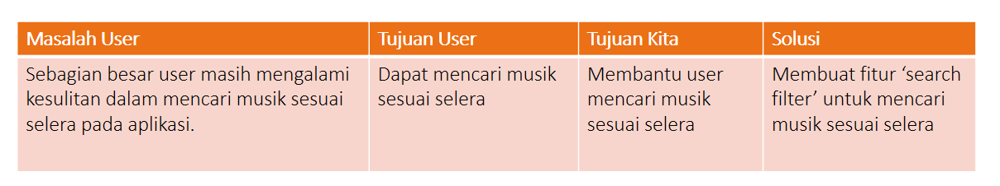

# Chapter 4 : Proses Design Thinking: Define - Menentukan

**Apa masalah user sebenarnya dan apa tujuan mereka? Apa yang bisa kita lakukan untuk membantu mereka?**

Menentukan sebenarnya apa yang dibutuhkan oleh user kita. Dari berbagai fakta lapangan yang kita peroleh pada tahap sebelum nya, disini kita simpulkan dan jadikan insight.

Dengan melihat permasalahan dengan sudut pandang tertentu, kita dapat menentukan mana yang jadi prioritas permasalahan yang akan kita selesaikan dengan solusi.

Di contoh sebelumnya kita sudah tahu masalah user sebenarnya, lalu kita dapat mencari tahu apa tujuan mereka dan apa solusi yang bisa kita buat.
