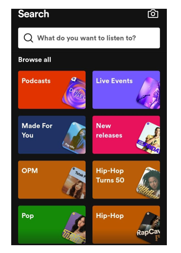

# Chapter 5 : Proses Design Thinking: Ideate – Membuat Ide

**Apa yang bisa kita buat untuk menyelesaikan masalah user tersebut?**

Tahap Ideate ialah tahap dimana kita mencari segala macam solusi yang dapat memecahkan permasalahan pada tahap sebelumnya. Diskusi dalam sebuah tim dan mencatat segala macam solusi yang dikemukakan. Dalam tahap ini ada beberapa prinsip dasar yang menjadi landasan proses Ideate.

Pada tahap Ideate biasanya tahap dimana desain visual akan dibuat. Misalnya tadi kita sudah menentukan bahwa kita akan membuat fitur mencari musik berdasarkan genre dan kita mencoba membuatnya dengan membuat ‘search filter’.
