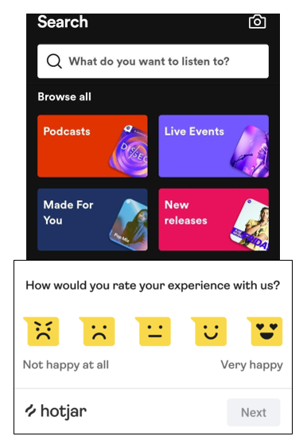

# Chapter 7 : Proses Design Thinking: Test – Menguji Ide

**Bagaimana pengalaman user dalam menggunakan aplikasi ini? Apakah user merasakan kesulitan?**

Pengujian atau tes merupakan tahap dimana kita memvalidasi apakah rancangan solusi yang kita buat sudah benar mampu menyelesaikan masalah user? atau ada hal yang dapat kita kembangkan?

Biasanya tahap tes dilakukan dengan memberikan prototype pada user lalu user akan memberikan tanggapan terhadap aplikasi tersebut melalui survei.

Tadi kita sudah membuat desain & prototype, maka kita sekarang akan mencari tahu tanggapan user dalam menggunakan fitur aplikasi ini, apakah user masih kesulitan dalam mencari musik sesuai selera atau tidak.
