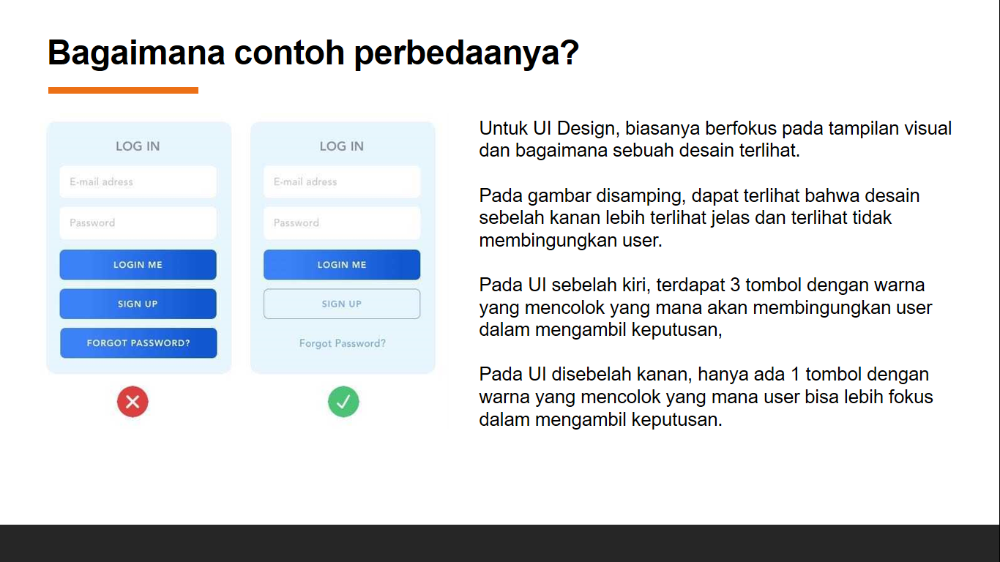
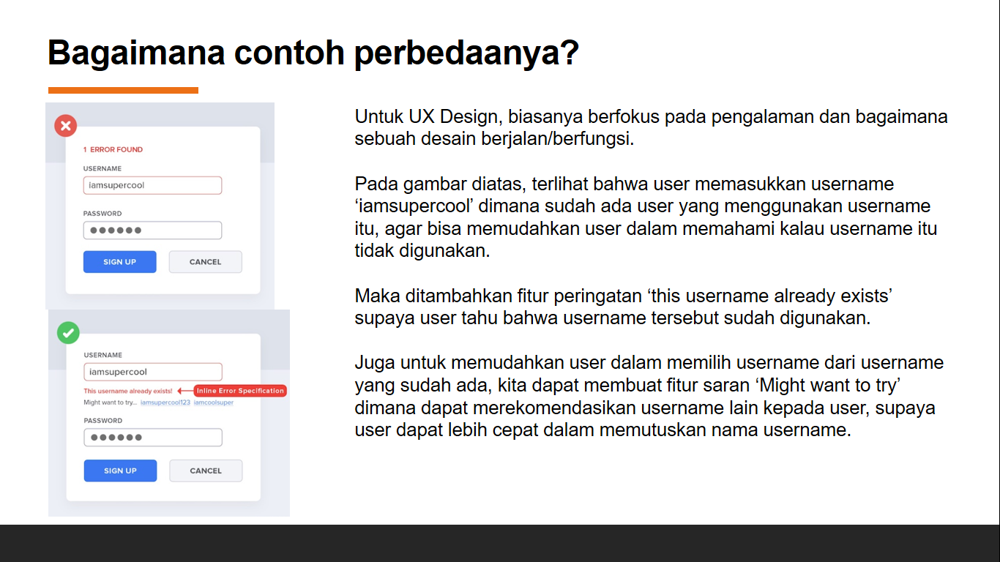

# Chapter 3 : Bagaimana contoh perbedaannya?

Untuk UI Design, biasanya berfokus pada tampilan visual dan bagaimana sebuah desain terlihat.

Pada gambar disamping, dapat terlihat bahwa desain sebelah kanan lebih terlihat jelas dan terlihat tidak membingungkan user.

Pada UI sebelah kiri, terdapat 3 tombol dengan warna yang mencolok yang mana akan membingungkan user dalam mengambil keputusan,

Pada UI disebelah kanan, hanya ada 1 tombol dengan warna yang mencolok yang mana user bisa lebih fokus dalam mengambil keputusan.

Untuk UX Design, biasanya berfokus pada pengalaman dan bagaimana sebuah desain berjalan/berfungsi.

Pada gambar diatas, terlihat bahwa user memasukkan username ‘iamsupercool’ dimana sudah ada user yang menggunakan username itu, agar bisa memudahkan user dalam memahami kalau username itu tidak digunakan.

Maka ditambahkan fitur peringatan ‘this username already exists’ supaya user tahu bahwa username tersebut sudah digunakan.

Juga untuk memudahkan user dalam memilih username dari username yang sudah ada, kita dapat membuat fitur saran ‘Might want to try’ dimana dapat merekomendasikan username lain kepada user, supaya user dapat lebih cepat dalam memutuskan nama username.

