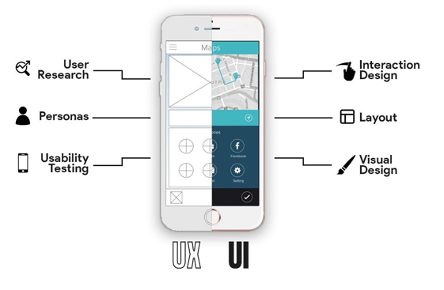

# Chapter 2 : Apa perbedaannya?

Perbedaan utama antara UI vs UX design terletak pada fokusnya.

UI design mengutamakan tampilan dan perasaan saat berinteraksi dengan produk. UI biasanya berfokus pada tampilan visual.

Di sisi lain, UX design menekankan pada efektivitas dan efisiensi pengalaman pengguna secara keseluruhan. Keduanya saling melengkapi dan sama pentingnya dalam keberhasilan pengembangan produk. UX biasanya berfokus pada fungsi

