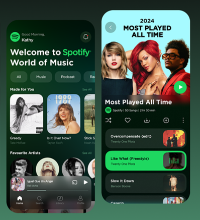

# Chapter 4 : Contoh pertanyaan tentang UI/UX Design

**Pertanyaan-pertanyaan tentang UI Design**
“Apakah pengguna merasa nyaman dengan susunan tombol dan warna pada aplikasi tersebut?”

“Apakah pengguna dapat dengan mudah mengetahui cara menambahkan lagu ke playlist dengan tampilan seperti itu?”

**Pertanyaan-pertanyaan tentang UX Design**
“Bagaimana cara memberikan rekomendasi musik yang sesuai dengan selera pengguna?”
“Apakah pengguna mengalami kesulitan ketika mendaftar/login Spotify?”
“Apakah pengguna spotify bisa berinteraksi dengan user lain? misal, berbagi rekomendasi musik dengan teman?”

