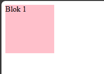
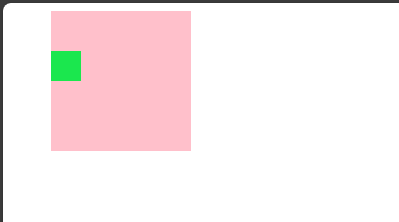

# Chapter 2 : Box Sizing

## Ukuran Elemen

Untuk mengatur ukuran lebar dan tinggi suatu elemen HTML kita memerlukan properti `width` dan `height`.

### Penerapan properti `width` dan `height`.

```js title="index.html"
<!DOCTYPE html>
<html lang="en">
  <head>
    <title>Latihan css</title>
    <link rel="stylesheet" href="style.css" />
  </head>
  <body>
    <div id="blok-1">Blok 1</div>
  </body>
</html>

```

```js title="style.css"
#blok-1 {
  background-color: pink;
  width: 100px;
  height: 100px;
}
```



### Catatan

Untuk satuan yang dipakai dalam menentukan ukuran elemen kalian bisa menggunakan `px`, `%`, `em`, `rem`, `vh`, `vw`.

## Jarak elemen

Untuk mengatur jarak antar elemen ataupun dengan lebar layar device dapat menggunakan dua properti berikut :

- `margin` digunakan untuk mengatur jarak di sekitar elemen, di luar batas yang ditentukan. Terdapat properti turunannya yaitu `margin-top`, `margin-right`, `margin-bottom`, `margin-left`
- `padding` digunakan untuk mengatur jarak di sekitar konten elemen, di dalam batas yang ditentukan. Terdapat properti turunannya yaitu `padding-top`, `padding-right`, `padding-bottom`, `padding-left`

### Penerapan properti `margin` dan `padding`

```js title="index.html"
<!DOCTYPE html>
<html lang="en">
  <head>
    <title>Latihan css</title>
    <link rel="stylesheet" href="style.css" />
  </head>
  <body>
    <div id="blok-1">
      <div id="blok-2"></div>
    </div>
  </body>
</html>

```

```js title="style.css"
#blok-1 {
  background-color: pink;
  box-sizing: border-box;
  width: 140px;
  height: 140px;
  margin-left: 40px;
  padding-top: 40px;
}

#blok-2 {
  background-color: rgb(27, 231, 78);
  width: 30px;
  height: 30px;
}

```


