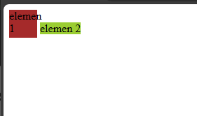

# Chapter 4 : Display

## Pengenalan Properti Display

Properti display dalam CSS digunakan untuk mengontrol bagaimana elemen HTML ditampilkan di halaman web. Sederhananya, properti ini menentukan bagaimana elemen terlihat dan berinteraksi dengan elemen lain pada halaman. Berikut ini beberapa contoh value untuk properti `display` yang sering digunakan :

- `block` adalah nilai default yang menampilkan elemen sebagai blok, menempati seluruh lebar yang tersedia dan memulai baris baru. Beberapa contoh tag block adalah : `<form>`, `<div>`, `<p>`, `<nav>`, `<footer>`, `<video>`.
- `inline` untuk menampilkan elemen sebagai elemen inline, di mana elemen hanya menempati ruang yang dibutuhkannya dan tidak memulai baris baru. Properti `width` dan `height` tidak memiliki efek. Beberapa contoh tag inline adalah : `<a>`, `<span>`, `<button>`, `<select>`, `<label>`, `<input>`
- `inline-block` adalah elemen yang di format inline, tetapi bisa mengatur properti `width` dan `height`.
- `none` digunakan untuk menyembunyikan elemen sepenuhnya dari tampilan. Elemen tidak akan menempati ruang apa pun di halaman web.
- `flex` untuk mengubah elemen menjadi item flexbox, memungkinkan tata letak yang lebih fleksibel dan responsif.

### Penerapan properti `display`.

```js title="index.html"
<!DOCTYPE html>
<html lang="en">
  <head>
    <title>Latihan css</title>
    <link rel="stylesheet" href="style.css" />
  </head>
  <body>
    <span id="e1">elemen 1</span>
    <span id="e2">elemen 2</span>
  </body>
</html>

```

```js title="style.css"
#e1 {
  width: 40px;
  height: 40px;
  background-color: brown;
  display: inline-block;
}

#e2 {
  width: 40px;
  height: 40px;
  background-color: yellowgreen;
}

```


