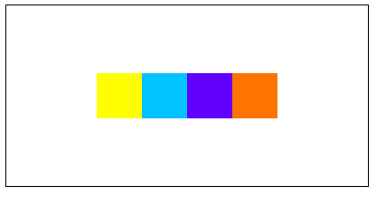

# Chapter 7 : Flex Box

## Pengenalan Flex Box

Flex box merupakan sebuah model layout fleksibel, yang memudahkan dalam responsif struktur layout tanpa menggunakan `float` atau `position`.

Langkah awal dalam membuat Flexbox model adalah dengan mendefinisikan sebuah `flex container`.

`display: flex;`

Beberapa properti dari Flex box antara lain :

- `flex-direction` untuk mendefinisikan arah dari container untuk menumpuk flex item. Misal, ingin menumpuk item ke bawah : `flex-direction: column;`
- `flex-wrap` menentukan apakah item di flex container harus dipaksa sejajarkan atau tidak ketika ukuran item sudah melewati flex container. Misal, ingin membuat item-item di flex container tidak di paksa sejajar dan akan turun kebawah ketika ukurannya sudah melewati flex container : `flex-wrap: wrap;`
- `flex-flow` adalah shorthand untuk mengatur `flex-direction` dan `flex-wrap`. Misal, ingin mengatur elemen ke horizontal dan akan turun ketika sudah tidak memenuhi ukuran flex container : `flex-flow: row wrap;`
- `justify-content` untuk menyelaraskan item-item flex. Misal, ingin menyelaraskan item ke posisi akhir (bagian kanan) dari container : `justify-content: flex-end;`
- `align-items` untuk menyelaraskan item secara vertical (ketika arah containernya baris). Misal, ingin menyelaraskan item ke tengah secara vertical : `align-items: center;`
- `align-content` untuk menyelaraskan garis-garis flex.

### Penerapan properti `Flex Box`.

```js title=index.html
<!DOCTYPE html>
<html lang="en">
  <head>
    <title>Latihan css</title>
    <link rel="stylesheet" href="style.css" />
  </head>
  <body>
    <div id="container">
      <div class="item-1"></div>
      <div class="item-2"></div>
      <div class="item-3"></div>
      <div class="item-4"></div>
    </div>
  </body>
</html>
```

```js title=style.css
#container {
  display: flex;
  width: 400px;
  height: 200px;
  border: 1px black solid;
  justify-content: center;
  align-items: center;
}
#container > div {
  width: 50px;
  height: 50px;
}
.item-1 {
  background-color: yellow;
}
.item-2 {
  background-color: rgb(0, 195, 255);
}
.item-3 {
  background-color: rgb(98, 0, 255);
}
.item-4 {
  background-color: rgb(255, 115, 0);
}

```


