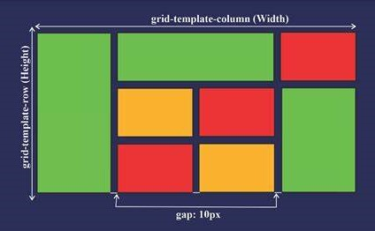

# Chapter 6 : Grid Layout

## Pengenalan Grid Layout

CSS Grid Layout menawarkan sistem tata letak berbasis grid, dengan baris dan kolom, sehingga lebih mudah untuk mendesain halaman web tanpa harus menggunakan float dan positioning.

`display: grid;`



Beberapa contoh properti untuk Grid Layout adalah :

- `justify-content`digunakan untuk menyelaraskan seluruh grid di dalam container. Dengan catatan Lebar total Grid harus kurang dari lebar kontainer agar properti `justify-content` memiliki efek. Misal, jika kamu ingin menyelaraskan seluruh grid ke tengah : `justify-content: center;`

- `align-content` digunakan untuk menyelaraskan seluruh Grid secara vertikal di dalam container. Dengan catatan tinggi total grid harus kurang dari tinggi container agar properti `align-content` memiliki efek. Misal, jika kamu ingin menyelaraskan Grid secara vertical ke bawah : `align-content: end;`

- `grid-template-columns` untuk Menentukan jumlah kolom dalam tata letak dan itu bisa menentukan lebar setiap kolom. Misal, jika kamu ingin mendefinisikan 3 kolom dengan lebar yang berbeda :
  `grid-template-columns: 20% 50% 30%;`

- `grid-template-rows` untuk mendefinisikan tinggi setiap baris. Misal, jika kamu ingin mendefinisikan tinggi baris dengan ukuran yang berbeda :
  `grid-template-rows: 40px 60px;`

- `grid-column` untuk menentukan kolom mana yang akan menempatkan item. Anda menentukan di mana item akan dimulai, dan di mana item akan berakhir (merupakan shorthand dari properti `grid-column-start` dan `grid-column-end`). Misal ingin menentukan kolom yang dimulai dari kolom 1 dan berakhir sebelum kolom 3 : `grid-column: 1 / 3`
- `grid-row` menentukan pada baris mana untuk menempatkan item. Anda menentukan di mana item akan dimulai, dan di mana item akan berakhir. (merupakan shorthand dari properti `grid-row-start` dan `grid-row-end`). Misal ingin menentukan baris yang dimulai dari baris-garis 1 dan berakhir di baris-garis 4 : `grid-column: 1 / 4`
- `gap` untuk menentukan jarak dari tiap-tiap item.

### Penerapan Grid Layout

```js title=index.html
<!DOCTYPE html>
<html lang="en">
  <head>
    <title>Latihan css</title>
    <link rel="stylesheet" href="style.css" />
  </head>
  <body>
    <div id="container">
      <div class="item-1"></div>
      <div class="item-2"></div>
      <div class="item-3"></div>
      <div class="item-4"></div>
      <div class="item-5"></div>
      <div class="item-6"></div>
    </div>
  </body>
</html>
```

```js title=style.css
#container {
  display: grid;
  width: 400px;
  height: 200px;
  border: 1px black solid;
  grid-template-columns: 20% 30% 50%;
  grid-template-rows: 30% 25% 45%;
}
.item-1 {
  background-color: yellow;
  grid-row: 1 / 4;
}
.item-2 {
  background-color: rgb(0, 195, 255);
}
.item-3 {
  background-color: rgb(98, 0, 255);
}
.item-4 {
  background-color: rgb(255, 115, 0);
  grid-column: 2 / 3;
  grid-row: 2 / 4;
}
.item-5 {
  background-color: rgb(255, 0, 242);
  grid-column: 3 / 4;
  grid-row: 3 / 4;
}
.item-6 {
  background-color: rgb(0, 255, 64);
}
```


