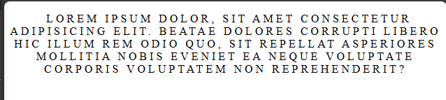

# Chapter 3 : Format Text

## Ukuran Elemen

Untuk mengatur penulisan sebuah text kita bisa menggunakan properti CSS seperti :

- `text-align` digunakan untuk mengatur perataan teks secara horizontal di dalam elemen.
- `text-transform` digunakan untuk mengubah kapitalisasi teks.
- `text-decoration` digunakan untuk menambahkan dekorasi pada teks.
- `text-indent` digunakan untuk menambahkan indensi atau indentasi pada baris pertama paragraf.
- `letter-spacing` Properti ini digunakan untuk mengatur jarak antar huruf dalam teks. Nilai yang digunakan adalah besaran jarak dalam piksel.

### Penerapan properti `text-align`, `text-transform`, `text-decoration`, `text-indent`, `letter-spacing`.

```js title="index.html"
<!DOCTYPE html>
<html lang="en">
  <head>
    <title>Latihan css</title>
    <link rel="stylesheet" href="style.css" />
  </head>
  <body>
    <p>
      Lorem ipsum dolor, sit amet consectetur adipisicing elit. Beatae dolores
      corrupti libero hic illum rem odio quo, sit repellat asperiores mollitia
      nobis eveniet ea neque voluptate corporis voluptatem non reprehenderit?
    </p>
  </body>
</html>

```

```js title="style.css"
p {
  text-align: center;
  text-transform: uppercase;
  text-decoration: dashed;
  text-indent: 10px;
  letter-spacing: 4px;
}
```


