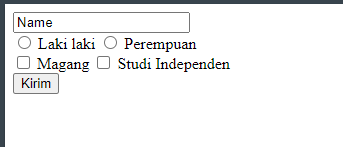
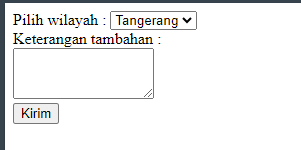

# Chapter 5 : Form HTML

## Form Tag

Pembuatan Form di HTML dapat dilakukan dengan beberapa tag dasar yang sering digunakan yaitu :

- `<form>` untuk membungkus isi form
- `<label>` untuk membuat nama ( label ) ke tag seperti tag `<input>` dan `<select>`
- `<input>` untuk membuat kolom input ( terdapat banyak jenisnya )
- `<button>` untuk membuat tombol
- `<textarea>` untuk membuat kolom input multi-line
- `<select>` untuk membuat drop-down list
- `<option>` untuk membuat pilihan opsi yang tersedia di drop-down list

### Penerapan Tag `<form>` , `<label>` , `<input>` dan `<button>`

```jsx title="index.html"
<!DOCTYPE html>
<html>
  <head>
    <title>Page Title</title>
  </head>
  <body>
    <form action="/api.js" target="_blank">
      <input type="text" value="Name">
      <br>
      <input type="radio" name="gender" value="cowok" id="b1">
      <label for="b1">Laki laki</label>
      <input type="radio" name="gender" value="cewek" id="b2">
      <label for="b2">Perempuan</label>
      <br>
      <input type="checkbox" value="magang" id="f1">
      <label for="f1">Magang</label>
      <input type="checkbox" value="studi independen" id="f2">
      <label for="f2">Studi Independen</label>
      <br>
      <button type="submit">Kirim</button>
    </form>
  </body>
</html>
```



:::info Keterangan

Tag `<form>` memiliki 2 attribut yang biasa digunakan yaitu :

- **action** untuk mendefinisikan aksi setelah form di submit, biasanya data form akan dikirim ke server setelah user klik tombol submit.
- **target** untuk secara spesifik menampilkan dimana respon akan muncul setelah form di submit. Valuenya : `_blank` , `_self` ( default ) , `_parent` , `_top`

Tag `<label>` memiliki 1 atribut wajib yaitu :

- `for` yang digunakan untuk menghubungkan tag `<label>` tersebut dengan tag lain seperti `<input>` dan `<select>`. Nilai dari atribut `for` berisi sama dengan atribut `id` di tag yang dituju.

Tag `<input>` memiliki sejumlah atribut yang sering dipakai seperti :

- `type` digunakan untuk mendefinisikan tipe dari input tersebut seperti `text` (default) , `radio` , `checkbox` , `password` , `email` , `file` , `date` , `color`.
- `id` digunakan sebagai penanda unik dari tag tersebut. Nilai dari `id` bebas, asalkan tidak sama dengan `id` pada tag lainnya.
- `name` digunakan untuk penamaan tag tersebut.
- `value` digunakan untuk inisialisasi nilai dari input tersebut.

Tag `<button>` memiliki atribut yang biasa dipakai yaitu :

- `type` digunakan untuk menentukan tipe dari button ini. Nilainya bisa berupa `button` , `reset` , `submit`.

:::

### Penerapan Tag `<select>` , `<option>` dan `<textarea>`

```jsx title="index.html"
<!DOCTYPE html>
<html>
  <head>
    <title>Page Title</title>
  </head>
  <body>
    <form action="/api.js" target="_blank">
      <label for="wilayah">Pilih wilayah :</label>
      <select name="wilayah" id="wilayah">
        <option value="tgr">Tangerang</option>
        <option value="jkt">Jakarta</option>
      	<option value="bdg">Bandung</option>
      </select>
      <br>
      <label for="keterangan">Keterangan tambahan :</label>
      <br>
      <textarea id="keterangan" rows="3" cols="16"></textarea>
      <br>
      <button type="submit">Kirim</button>
    </form>
  </body>
</html>
```



:::info Keterangan

Tag `<textarea>` memiliki atribut tambahan yang sering dipakai yaitu :

- `rows` untuk mengatur lebar kolom input
- `cold` untuk mengatur tinggi kolom input

:::
