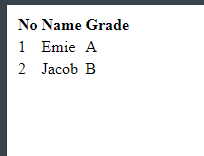

# Chapter 4 : Tabel HTML

## Tabel Tag

HTML mengdukung untuk pembuatan tabel. Beberapa tag dasar yang sering digunakan untuk membuat tabel adalah :

- `<table>` untuk membungkus tag lain ketika membuat tabel
- `<tr>` untuk menentukan tiap baris di tabel
- `<td>` untuk menentukan tiap data di tabel
- `<th>` untuk menentukan tiap data header di table

### Penerapan Tag `<h1>` sampai `<h6>`

```jsx title="index.html"
<!DOCTYPE html>
<html>
  <head>
    <title>Page Title</title>
  </head>
  <body>
    <table>
    <tr>
        <th>No</th>
        <th>Name</th>
        <th>Grade</th>
    </tr>
    <tr>
        <td>1</td>
        <td>Emie</td>
        <td>A</td>
    </tr>
    <tr>
        <td>2</td>
        <td>Jacob</td>
        <td>B</td>
    </tr>
    </table>
  </body>
</html>
```



:::info Catatan

Untuk menampilkan border pada tabel bisa menggunakan properti css `border` yang nanti akan kita pelajari.

:::
