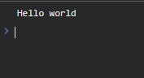

# Chapter 1 : Pengenalan Javascript

## Statement

Statement (pernyataan) di Javascript merupakan sebuah baris perintah yang dapat berisi nilai, operator, ekspresi, keyword, dan komentar.

### Contoh Statement

```jsx title="script.js"
console.log("Hello world");
```



:::info Tambahan
Perintah `console.log()` digunakan untuk mencetak teks ke console browser.

Untuk menghubungkan file HTML dan file Javascript, gunakan tag `<script>` dan tuliskan nama file javascript nya di atribut `src`

```jsx title="index.html"
<!DOCTYPE html>
<html lang="en">
  <head>
    <title>Latihan Javascript</title>
  </head>
  <body>
    <script src="script.js"></script>
  </body>
</html>
```

:::

## Variabel

Di dalam javascript untuk menyimpan suatu nilai dapat menggunakan variabel. Terdapat 3 jenis keyword untuk menginisialisasi variabel :

- `var` adalah keyword yang digunakan di browser lama dan tidak mendukung scoping.
- `let` adalah keyword yang digunakan jika suatu saat nilai dari variabel bisa berubah dan mendukung block scope.
- `const` adalah keyword yang digunakan saat nilai dari variabel tidak akan berubah lagi, digunakan untuk mendefinisikan `array` dan `object` serta mendukung block scope.

Cara mendefinisikan sebuah variabel adalah dengan menyebutkan keyword, nama variabel, operator penugasan (=) dan nilai variabel tersebut.

### Contoh Pembuatan Variabel

```jsx title="script.js"
let nama = "Kayla";
```

## Tipe Data

Sebuah nilai didalam variabel tentunya memiliki tipe data nya masing-masing. Berikut ini adalah beberapa contoh tipe data yang sering digunakan.

### undefined

Adalah tipe data yang belum mempunyai nilai dan belum dideklarasikan nilainya.

```
  let mahasiswa;
```

### null

Adalah tipe data yang belum mempunyai nilai.

```
  let mahasiswa = null;
```

### string

Adalah tipe data yang dipakai untuk nilai teks dan diapit oleh kutip ganda atau kutip tunggal.

```
  let mahasiswa = "kayla";
```

### number

Adalah tipe data yang dipakai untuk nilai angka bisa bilangan bulat ataupun pecahan.

```
  let nilai_1 = 7.5;
  let nilai_2 = 8;
```

### boolean

adalah tipe data yang digunakan untuk menyatakan benar atau salah. Hanya memiliki dua jenis nilai yaitu `true` dan `false`

```
  let status = true;
```

### array

Adalah struktur data yang digunakan untuk menyimpan banyak nilai didalam kurung siku []. Setiap nilai dipisah dengan tanda koma.

```
  let mahasiswa = ["kayla", "restu", "anggi", "riski"];
```

Untuk mengakses suatu nilai didalam array tinggal sebutkan nama array yang ingin diakses, lalu kurung kurawal siku [] dan didalamnya sebutkan index yang mau diakses. Perlu diingat nilai pertama di array adalah index 0.

Misalnya ingin mengakses mahasiswa bernama "anggi" maka gunakan perintah.

```
    let mahasiswa = ["kayla", "restu", "anggi", "riski"];

    mahasiswa[2];
```

### object

Adalah struktur data yang digunakan untuk menyimpan banyak nilai didalam kurung kurawal {} dan. Setiap nilai ditulis dengan format properti : nilai dan dipisah dengan koma.

```
  let mahasiswa = {nama: "kayla", nim: 2222475713};
```

Untuk mengakses suatu nilai didalam object tinggal sebutkan nama object yang ingin diakses, lalu diikuti dengan properti yang dituju.

Misalnya ingin mengakses nim dari mahasiswa tersebut maka gunakan perintah.

```
    let mahasiswa = {nama: "kayla", nim: 2222475713};

    mahasiswa.nim;
```

## Komentar

Didalam javascript komentar digunakan untuk menjelaskan kode javascript dan membuat program mudah untuk dibaca.

Komentar di javascript juga digunakan untuk mencegah suatu perintah dieksekusi saat proses uji coba.

### Contoh Komentar Single line

```
  // perintah untuh mencetak.
  console.log("Sudah terdaftar");
```

### Contoh Komentar Multi line

```
  /*
  perintah untuk mencetak
  dapat digunakan juga untuk hal lainnya.
  */
  console.log("Sudah terdaftar");
```
