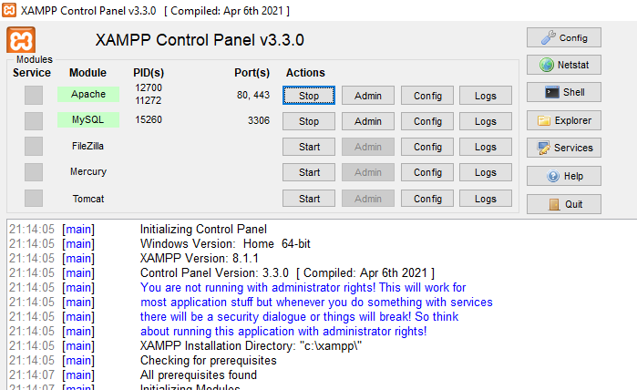

# Chapter 1 : Pengenalan XAMPP

XAMPP merupakan media atau web server localhost yang bisa digunakan secara offline. Melalui XAMPP, pengguna dapat mengelola database yang berada di localhost tanpa memerlukan akses internet.

Adapun XAMPP memiliki kepanjangan X (cross platform), A (Apache), M (MySQL/MariaDB), P (PHP), dan P (Perl). Kepanjangan XAMPP tersebut merupakan program yang tersedia pada software ini.

## Menjalankan HTTP Server dan Database

