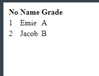

# Chapter 5 : Form HTML

## Form Tag

Pembuatan Form di HTML dapat dilakukan dengan beberapa tag dasar yang sering digunakan yaitu :

- `<form>` untuk
- `<label>` untuk
- `<input>` untuk
- `<button>` untuk
- `<textarea>` untuk
- `<select>` untuk
- `<option>` untuk

### Penerapan Tag `label` , `<input>` , `<textarea>` dan `<button>`

```jsx title="index.html"
<!DOCTYPE html>
<html>
  <head>
    <title>Page Title</title>
  </head>
  <body>
    <form action="/">
    <input type="text" value="Name">
    <br>
    <input type="radio" name="gender" value="cowok" id="b1">
    <label for="b1">Laki laki</label>
    <input type="radio" name="gender" value="cewek" id="b2">
    <label for="b2">Perempuan</label>
    <br>
    <input type="checkbox" value="magang" id="f1">
    <label for="f1">Magang</label>
    <input type="checkbox" value="studi independen" id="f2">
    <label for="f2">Studi Independen</label>
    <br>
    <label for="cars">Choose a car:</label>

    <select name="cars" id="cars">
    <option value="volvo">Volvo</option>
    <option value="saab">Saab</option>
    <option value="mercedes">Mercedes</option>
    <option value="audi">Audi</option>

    <br>
    </select>  <button type="submit">Kirim</button>
    </form>
  </body>
</html>
```



### Catatan

Untuk menampilkan border pada tabel bisa menggunakan syntax css `border` yang nanti akan kita pelajari.

### Penerapan Tag `<select>` dan `<option>`
