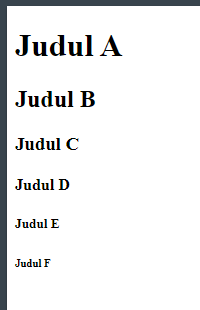
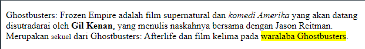

# Chapter 3 : Tipografi HTML

## Heading Tag

Untuk penulisan judul maupun sub judul, HTML memiliki 6 ukuran text dari yang paling besar `<h1>` sampai yang paling kecil `<h6>`

### Penerapan Tag `<h1>` sampai `<h6>`

```jsx title="index.html"
<!DOCTYPE html>
<html>
  <head>
    <title>Page Title</title>
  </head>
  <body>
    <h1>Judul A</h1>
    <h2>Judul B</h2>
    <h3>Judul C</h3>
    <h4>Judul D</h4>
    <h5>Judul E</h5>
    <h6>Judul F</h6>
  </body>
</html>
```



## Paragraf Tag

Penulisan sebuah paragrah di HTML menggunakan tag `<p>`. Lalu terdapat tag tambahan untuk memperjelas dari setiap kalimat, kata, spasi, dll. Diantaranya :

- `<br>` untuk pindah baris
- `<i>` untuk membuat text italic (miring)
- `<b>` untuk membuat text bold (tebal)
- `<mark>` untuk menandai text
- `<small>` untuk mengecilkan text

### Penerapan Tag `<p>` , `<br>` , `<i>` , `<b>` , `<mark>` , `<small>`

```jsx title="index.html"
<!DOCTYPE html>
<html>
  <head>
    <title>Page Title</title>
  </head>
  <body>
    <p>
    Ghostbusters: Frozen Empire adalah film supernatural dan <i>komedi Amerika</i> yang akan datang disutradarai oleh <b>Gil Kenan</b>, yang menulis naskahnya bersama dengan Jason Reitman. <br>Merupakan <small>sekuel</small> dari Ghostbusters: Afterlife dan film kelima pada <mark>waralaba Ghostbusters</mark>.
    </p>
  </body>
</html>
```


