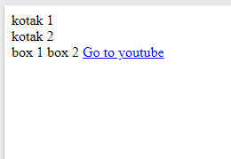

# Chapter 2 : Tag Dasar HTML

Tag di dalam HTML didefinisikan dengan `<namaTag>` lalu `nilai` dan diakhiri dengan `</namaTag>` . Beberapa contoh Tag dasar yang sering digunakan adalah :

- `<div>` digunakan untuk membuat elemen Block (Tag setelah elemen ini akan dicetak ke bawah)
- `<span>` digunakan untuk membuat elemen Inline (Tag setelah elemen ini akan dicetak sejajar kesamping)
- `<a>` untuk menyematkan tautan ( memiliki attribute **href** yang digunakan untuk memasukan tautan )

## Penerapan Tag `<div>`, `<span>` dan `<a>`

```jsx title="index.html"
<!DOCTYPE html>
<html>
  <head>
    <title>Page Title</title>
  </head>
  <body>
    <div>kotak 1</div>
    <div>kotak 2</div>

    <span>box 1</span>
    <span>box 2</span>

    <a href="https://www.youtube.com">Go to youtube</a>
  </body>
</html>
```



### Tambahan

Beberapa Tag HTML hanya menggunakan `<namaTag>` tanpa memakai `</namaTag>`. Misalnya seperti `img` untuk memasukan gambar. Memiliki beberapa attribute diantaranya :

- **src** untuk memasukan directory ( lokasi penyimpanan ) gambar ataupun link gambar dari internet
- **alt** untuk menampilkan nama gambar ketika gambar gagal di load
- **width** untuk mengatur lebar gambar
- **height** untuk mengatur tinggi gambar

## Penerapan Tag ``

```jsx title="index.html"
<!DOCTYPE html>
<html>
  <head>
    <title>Page Title</title>
  </head>
  <body>
    
  </body>
</html>
```


